# 🕺 Forroflix — Plataforma de Streaming e Ensino de Forró

> Uma plataforma moderna e premium no estilo "Netflix" voltada para o aprendizado e streaming de vídeoaulas de Forró, equipada com um construtor de grade curricular interativo e uploads diretos de vídeo de alta performance.

---

## 🚀 Visão Geral do Projeto
O **Forroflix** é um sistema LMS (Learning Management System) altamente otimizado com foco em experiência de uso premium, agilidade e fluidez. Ele permite que estudantes assistam a vídeoaulas com player responsivo e marquem progresso, enquanto fornece aos administradores ferramentas robustas de arrastar-e-soltar para organizar módulos, reordenar conteúdos, realizar ações em lote e efetuar uploads massivos de vídeo direto do navegador para a CDN.

---

## 🛠️ Arquitetura e Stack Tecnológica

* **Core**: [Next.js 16 (App Router)](https://nextjs.org/) & [React 19](https://react.dev/)
* **Estilização**: [Tailwind CSS v4](https://tailwindcss.com/) com variáveis HSL/OKLCH customizadas para modo escuro e glows.
* **Componentes de Acessibilidade**: [Base UI](https://base-ui.com/) (motor de acessibilidade do Shadcn v4 "base-nova") para garantir comportamento estável e interativo.
* **Banco de Dados**: Cloudflare D1 (Banco de dados SQLite na borda (Edge) de alta velocidade) operando sob transações atômicas `db.batch()`.
* **Hospedagem & Transcodificação de Vídeo**: [Bunny CDN (Edge Storage & Stream)](https://bunny.net/) para reprodução de vídeo adaptativa via HLS.
* **Protocolo de Upload**: Protocolo TUS (retomável) com a biblioteca `tus-js-client` para garantir envios resilientes de arquivos pesados.

---

## 🎓 Funcionalidades — Área do Aluno (Streaming)

### 🖥️ Interface "Netflix-Style"
* **Catálogo de Cursos**: Listagem dinâmica de cursos de Forró categorizados, com visualização em grade estilizada e gradientes de cores dinâmicos nas miniaturas.
* **Tema Escuro Nativo**: Design escuro profundo com destaque em laranja neon quente para simular uma sala de cinema.

### 📼 Player de Vídeo Responsivo (Vidstack)
* **Controles Customizados**: Player de alto desempenho com atalhos de teclado, velocidade de reprodução customizada, controle de volume avançado e barra de progresso.
* **Fila de Próxima Aula**: Avanço de aula automático opcional (Autoplay) quando o vídeo atual é encerrado.

### 📝 Controle de Progresso e Favoritos
* **Marcação de Conclusão**: Checkbox redondo interativo em cada aula para marcar como concluída, sincronizando instantaneamente no banco de dados com feedback visual (Toast).
* **Pastas de Favoritos com Escopo**:
  * **Globais**: Pastas como *"Revisar Passo"*, *"Aprender Depois"* e *"Favoritas do Coração"* visíveis e compartilhadas entre todos os cursos.
  * **Locais (Deste Curso)**: Pastas exclusivas do curso ativo que ajudam a organizar a prática de movimentos específicos do curso em questão.

---

## ⚙️ Funcionalidades — Painel do Administrador (Painel do Criador)

### 🗂️ Construtor de Grade Curricular Interativa (`CourseEditor`)
* **Edição Inline Simples**: Renomeie títulos de módulos ou títulos/descrições de vídeoaulas dando um clique no botão de edição diretamente na grade, sem recarregar a página.
* **Módulos Colapsáveis**: Botão de chevron individual para expandir/colapsar os módulos, facilitando o gerenciamento de cursos extensos.
* **Handles de Grip**: Ícones direcionais para arrastar de forma intuitiva.

### 🖱️ Sistema de Reordenação por Arrastar-e-Soltar (Drag & Drop)
* **Reordenação de Módulos**: Mude a ordem de exibição dos módulos do curso arrastando-os verticalmente.
* **Reordenação Interna de Aulas**: Ajuste a ordem de exibição das aulas dentro de um módulo.
* **Transferência entre Módulos**: Mova uma aula de um módulo para outro apenas arrastando e soltando. Suporta dropzones inteligentes em módulos vazios com efeitos visuais pontilhados.

### ⚡ Ações em Lote e Movimentação Alternativa
* **Checkboxes Customizados Premium**: Componente de checkbox acessível baseado em `@base-ui/react/checkbox` com glows em laranja néon. Suporta estado **indeterminado** (traço horizontal `-`) se apenas uma parte das aulas do módulo estiver marcada.
* **Barra Flutuante de Ações (Floating Toolbar)**: Surge ao selecionar uma ou mais aulas e fornece ações como:
  * **Mover em Lote**: Transfere todas as aulas marcadas para um módulo selecionado instantaneamente.
  * **Excluir em Lote**: Exclui permanentemente várias aulas simultâneas do banco.
* **Movimentação Expressa**: Opção por clique (ícone de pasta `FolderInput`) para transferir aulas entre módulos sem necessidade de arrastá-las.

### 📤 Upload Híbrido em Lote (Direct-to-Cloud TUS)
O sistema de upload do Forroflix está conectado diretamente à API do Bunny Stream e funciona em dois modos principais:
1. **Upload em Lote Global (Estruturado)**:
   * Permite arrastar pastas inteiras do computador para dentro do modal.
   * O sistema analisa a árvore de diretórios: o **nome da pasta** vira o **Módulo**, e os **vídeos** aninhados nela viram as **Aulas** ordenadas.
2. **Upload em Lote Local (Por Módulo)**:
   * Ao acionar o botão de lote dentro de um módulo existente, o modal se adapta.
   * Remove o modo diretório e aceita a seleção de múltiplos arquivos de vídeo soltos de uma vez, salvando todos direto como lições subsequentes no módulo aberto.

---

## 📡 Fluxo Técnico de Vídeos (Bunny CDN + TUS)

Para garantir escalabilidade e evitar gargalos no servidor Next.js, o upload de vídeos nunca passa pelo backend do projeto. O fluxo funciona da seguinte forma:

```mermaid
sequenceDiagram
    participant Browser as Navegador (Admin)
    participant Back as Backend Next.js
    participant DB as Cloudflare D1 (SQL)
    participant Bunny as Bunny CDN Stream

    Browser->>Back: Solicita Importação Estruturada (IDs temporários e títulos)
    Back->>Bunny: Cria placeholders de vídeo vazios (Criação de Video ID)
    Bunny-->>Back: Retorna Video IDs criados
    Back->>Back: Gera assinaturas TUS temporárias (SHA256 HMAC)
    Back->>DB: Registra Módulos e Aulas com status 'pending' e Video IDs
    Back-->>Browser: Envia Video IDs, assinaturas TUS e credenciais
    
    rect rgb(20, 20, 32)
        note right of Browser: Fila de Upload TUS Concorrente (Máx: 3 envios simultâneos)
        Browser->>Bunny: Faz o upload do arquivo em pedaços usando TUS
        Bunny-->>Browser: Confirma término do Upload
    end
    
    Browser->>Back: Notifica término com PATCH (uploadStatus: 'completed')
    Back->>DB: Atualiza status da aula para 'completed' no banco
    Note over Bunny: Bunny CDN codifica o vídeo para HLS (background)
```

### Detalhes de Performance no Upload:
* **Fila Concorrente**: Processa no máximo 3 uploads simultâneos para não travar a banda do usuário.
* **Retomabilidade**: Em caso de falha de conexão, o TUS Client retoma o upload do mesmo byte em que parou.
* **Retry Individual**: Botão de atualização manual na interface para re-enviar vídeos que falharam.

---

## 🗃️ Modelo de Dados (Esquema SQLite / D1)

O banco de dados é estruturado de forma relacional atômica com cascade e índices ordenados:

* **`courses`**: Guarda o slug do curso, título, descrição curta e o gradiente do thumbnail.
* **`modules`**: Registra os módulos vinculados ao curso, ordenados pela coluna `position`.
* **`lessons`**: Guarda a aula, referenciando o `module_id`, o `video_id` da Bunny CDN, progresso de upload (`upload_status`) e ordenação (`position`).
* **`progress`**: Tabela de relacionamento `user_id <-> lesson_id` anotando se a aula foi concluída (`completed = 1`).
* **`favorites`**: Registra as pastas de favoritos personalizadas (`name`, `course_id` opcional para pastas locais, `is_global` para pastas compartilhadas) e as aulas associadas em sua tabela pivô.
